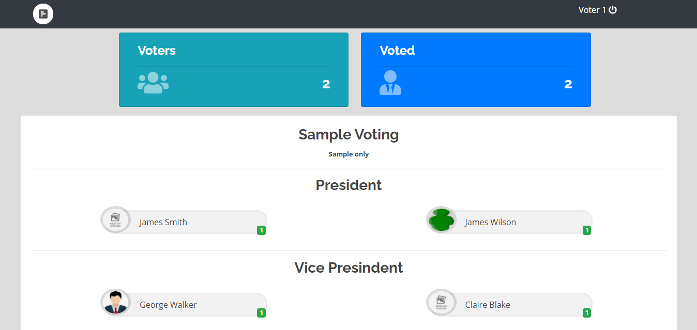

<div align="center">


# 🗳️ E-Voting Machine

**A secure, web-based Electronic Voting Management System**

[](https://www.php.net/)
[](https://www.mysql.com/)
[](https://www.apachefriends.org/)
[](https://developer.mozilla.org/en-US/docs/Web/JavaScript)
[]()
[]()

<br/>

> A full-featured online election platform — admins run secure, category-based elections while voters cast ballots through an authenticated, guided interface.

</div>

---

## 📋 Table of Contents

- [Overview](#-overview)
- [Live Preview](#-live-preview)
- [Features](#-features)
- [Tech Stack](#️-tech-stack)
- [Project Structure](#-project-structure)
- [Setup & Installation](#️-setup--installation)
- [Usage](#-usage)
- [Security](#-security)
- [Author](#-author)

---

## 🔍 Overview

The **E-Voting Machine** digitizes the complete election lifecycle — from voter registration and candidate management, all the way to real-time result tracking and printable ballot reports. It is designed for institutions, colleges, and organizations that require a structured, role-separated voting platform built on standard web technologies.

Admin and voter roles are clearly isolated, ensuring election data is managed centrally while voters interact with a clean, guided voting flow.

---

## 🖼️ Live Preview

<div align="center">

### 📊 Election Standings — Real-Time Results Dashboard



*Live vote standings displayed after each voting session — updated in real time via AJAX.*

</div>

---

## ✨ Features

<div align="center">

| 🔐 Authentication | 🗂️ Election Management | 📊 Results & Reporting |
|:-----------------:|:---------------------:|:---------------------:|
| Secure voter login | Multi-category elections | Live vote standings |
| Session-based access | Candidate profile management | Printable vote sheets |
| Admin / Voter role separation | Voter registration & control | Per-category result viewer |
| One vote per voter enforced | Open / close voting sessions | AJAX-powered live updates |

</div>

**Platform Highlights:**

- 🏛️ **Admin Dashboard** — Centralized control over all election operations
- 👥 **Voter Management** — Register, manage, and authenticate all voter accounts
- 📂 **Category-Based Voting** — Run multiple simultaneous election categories (e.g., President, Secretary, Treasurer)
- ⚡ **AJAX-Powered Interface** — Smooth, responsive interactions without full page reloads
- 🧾 **Vote Sheet Generation** — Printable ballot summaries for audit and record-keeping
- 📈 **Real-Time Standings** — Instant result visibility for authorized users (see screenshot above)

---

## 🛠️ Tech Stack

<div align="center">

| Layer | Technology | Purpose |
|-------|-----------|---------|
| **Backend** |  PHP 7.x | Server-side logic, session handling, admin operations |
| **Database** |  MySQL 5.x | Storing voters, candidates, categories, and votes |
| **Frontend** |  HTML / CSS / JS | UI rendering, form handling, and dynamic updates |
| **Async** |  Vanilla AJAX | Asynchronous requests routed through `ajax.php` |
| **Server** |  XAMPP / WAMP | Local development Apache server environment |

</div>

---

## 📂 Project Structure

```
E-Voting-Machine/
│
├── 🔑  index.php                    # Entry point / landing page
├── 🔐  login.php                    # Voter authentication page
├── 🏠  home.php                     # Voter dashboard after login
│
├── 🗳️   voting.php                   # Core voting interface
├── 📋  voting_list.php              # Active elections listing
├── 🧾  vote_sheet.php               # Printable ballot summary
├── 📊  view_vote.php                # Results viewer
│
├── ⚙️   admin_class.php              # Admin business logic & methods
├── 🔄  ajax.php                     # AJAX request handler
├── 🗄️   db_connect.php               # Database connection config
│
├── 📁  categories.php               # Election category management
├── 🔧  manage_catset.php            # Category settings control
├── 👤  manage_opt.php               # Candidate / option management
├── 👥  manage_user.php              # Voter account management
├── 🗳️   manage_voting.php            # Voting session control
├── 📄  users.php                    # Voter listing view
│
├── 🔗  header.php                   # Common HTML header template
├── 🧭  navbar.php                   # Navigation bar component
├── 📌  topbar.php                   # Top navigation bar
├── 📦  files.php                    # Shared file includes & utilities
│
├── 📸  standings.PNG                # Live results screenshot (shown above)
└── 📦  Voting-Management-System.zip # Full project archive with DB
```

---

## ⚙️ Setup & Installation

### Prerequisites

| Tool | Version | Link |
|------|---------|------|
|  PHP | 7.x or higher | [php.net](https://www.php.net/downloads) |
|  MySQL | 5.x or higher | [mysql.com](https://dev.mysql.com/downloads/) |
|  XAMPP / WAMP | Latest | [apachefriends.org](https://www.apachefriends.org/) |

---

### 🚀 Installation Steps

**1. Clone the repository**

```bash
git clone https://github.com/PushpenderKumar7505/E-Voting-Machine.git
```

**2. Move to your server root**

```bash
# XAMPP (Windows)
C:/xampp/htdocs/E-Voting-Machine/

# WAMP (Windows)
C:/wamp64/www/E-Voting-Machine/

# Linux
/var/www/html/E-Voting-Machine/
```

**3. Import the database**

Open **phpMyAdmin** → create a new database (e.g., `evoting_db`) → click **Import** → select the SQL file from inside `Voting-Management-System.zip`.

**4. Configure database connection**

Edit `db_connect.php` with your local credentials:

```php
<?php
$conn = new mysqli("localhost", "root", "", "evoting_db");

if ($conn->connect_error) {
    die("Connection failed: " . $conn->connect_error);
}
?>
```

**5. Run the application**

Start Apache and MySQL from your control panel, then open:

```
http://localhost/E-Voting-Machine/
```

---

## 🖥️ Usage

### 👨‍💼 Admin Workflow

```
Login as Admin
    └── Create Election Categories  (President, Secretary, etc.)
        └── Add Candidates per Category
            └── Register Voter Accounts
                └── Open Voting Session
                    └── Monitor Live Standings  ──▶  see standings.PNG above
                        └── Close Session & Export Final Results
```

### 🧑‍💻 Voter Workflow

```
Login with Registered Credentials
    └── View Active Elections on voting_list.php
        └── Cast Vote per Category on voting.php
            └── Receive Confirmation
                └── View Results via view_vote.php
```

---

## 🔒 Security

| Feature | How It Works |
|--------|-------------|
| **One Vote Per Voter** | Database-level enforcement — duplicate submissions are rejected |
| **Session Authentication** | PHP sessions validate identity on every page request |
| **Role Separation** | Admin and voter panels are completely isolated in code and routing |
| **Input Validation** | Server-side validation on all form data handled via `admin_class.php` |

---

## 👤 Author

<div align="center">


**Pushpender Kumar**

*B.Tech Computer Science & Engineering — GLA University, Mathura*

[](https://github.com/PushpenderKumar7505)
[](https://linkedin.com/in/pushpender-kumar)

*Aspiring DevOps & Cloud Engineer | AWS · Docker · Kubernetes · Jenkins · Terraform · Ansible*

</div>

---

<div align="center">

### ⭐ Found this useful? Give it a star!


*Feel free to fork, contribute, or raise issues.*

</div>
